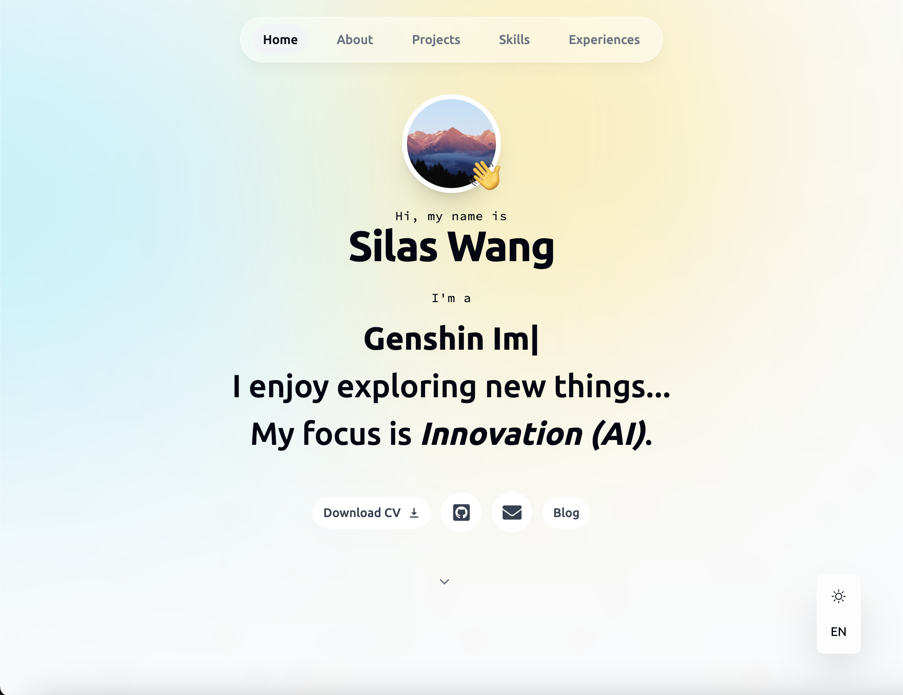
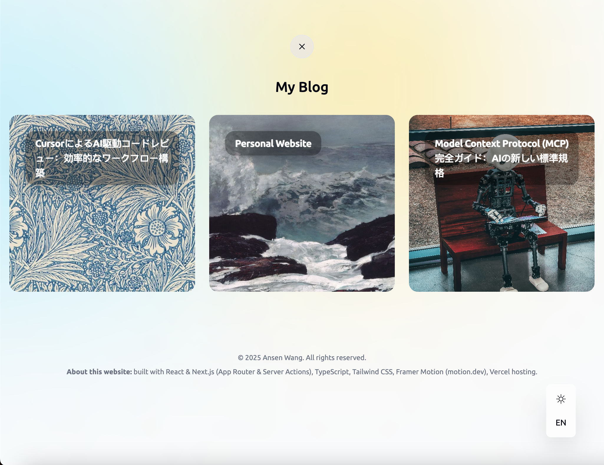

## Portfolio Project

Welcome to my portfolio project! This repository features my personal portfolio website.
Built using Next.js 15 and tailwind v4. The website features a blog powered by the Notion API, serving as the CMS. The design is inspired by inspired by [ByteGrad](https://www.youtube.com/watch?v=sUKptmUVIBM&t=21888s), focusing on simplicity and user-friendly interfaces.

## What I Did

- Next.js 15 & Tailwind CSS v4: Upgraded to the latest versions to leverage improved performance, enhanced developer experience, and modern styling capabilities.
- Blog: Added a fully functional blog section with article listings, detailed post views.
- Notion API: Integrates Notion as a headless CMS to manage and retrieve blog content dynamically.
- Drag & Drop cards: Added a draggable About UI interface.
- Bug Fixes: Fixed the scrolling bug from the original project.
- Updated Skill Section: Revamped the "Skills" and "Projects" sections.
- UX Enhancements: Added animations, and arrow indicators for a more engaging experience.
- Multilingual Support: Added japanese language options using i18nNext.

## ブログ（Notion）

記事は Notion の「Blog Posts」データベースに置き、公式 Notion API で読む。

| プロパティ | 型 | 用途 |
| --- | --- | --- |
| Title | タイトル | 記事タイトル（タグは入れない） |
| Status | セレクト | `Draft` / `Published` / `Archived`。**`Published` だけがサイトに出る** |
| Language | セレクト | `ja` / `zh` / `en`。本文の言語（一覧の言語フィルタ・字形） |
| Tags | マルチセレクト | タグ |
| Published | 日付 | 公開日。一覧の並び順。空なら作成日時 |
| Summary | テキスト | 一覧カードと meta description（任意） |
| Translations | リレーション | 同じ記事の他言語版。片側だけ張れば両方向に効く |

公開の流れ: 行を作る（Status=Draft）→ 書く → Status を Published にする。ページを移動する必要はない。

### セットアップ

1. Notion の開発者ツール（https://app.notion.com/developers/connections ）で「新しい接続」を作る。認証方式は「API トークン」、権限は「コンテンツを読み取る」だけでよい
2. Blog Posts データベースの「•••」→「連携（インテグレーション）」から、その接続を追加する
3. Vercel の環境変数に `NOTION_TOKEN` と `NOTION_BLOG_DATA_SOURCE_ID` を入れる（`.env.example` 参照）
4. 任意: インテグレーションの Webhooks に `https://<サイト>/api/revalidate` を登録すると、Notion を編集した直後に反映される。登録時に届く verification_token は Vercel のログに出るので、Notion の画面に貼って検証し、同じ値を `NOTION_WEBHOOK_VERIFICATION_TOKEN` に入れる。未設定でも一覧は 1 分、記事は 5 分で入れ替わる

ワークスペースを「Web に公開」する必要はない。

## Contributions

Contributions are welcome! Fork the repository and submit a pull request.
