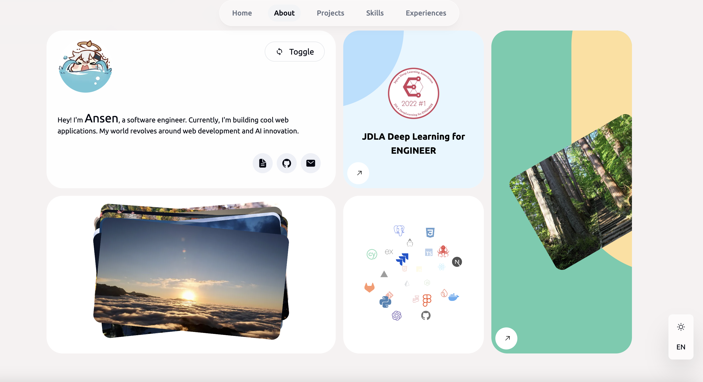

## Portfolio Project

Welcome to my portfolio project! This repository features my personal portfolio website, inspired by [ByteGrad](https://www.youtube.com/watch?v=sUKptmUVIBM&t=21888s).

## What I Did

- Next.js 15 & Tailwind CSS 4: Upgraded to the latest versions to leverage improved performance, enhanced developer experience, and modern styling capabilities.
- Blog: Added a fully functional blog section with article listings, detailed post views.
- Notion API: Integrates Notion as a headless CMS to manage and retrieve blog content dynamically.
- Bug Fixes: Fixed the scrolling bug from the original project.
- Updated Skill Section: Revamped the "Skills" and "Projects" sections.
- UX Enhancements: Added animations, and arrow indicators for a more engaging experience.
- Multilingual Support: Added multiple language options using i18nNext.

## Contributions

Contributions are welcome! Fork the repository and submit a pull request.